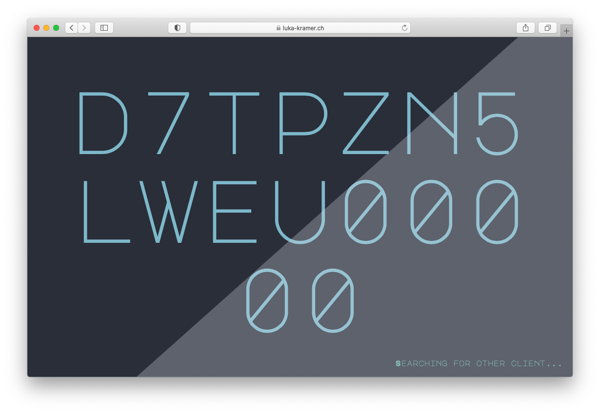

# Realtime video manipulation
HSLU Studio Web & Mobile 2 module project.

## Technologies
Websocket (socket.io) & WebRTC (peer.js)

## Objective
Multidevice experiment & get some experience with the technologies mentioned above. 

## Screenshots

